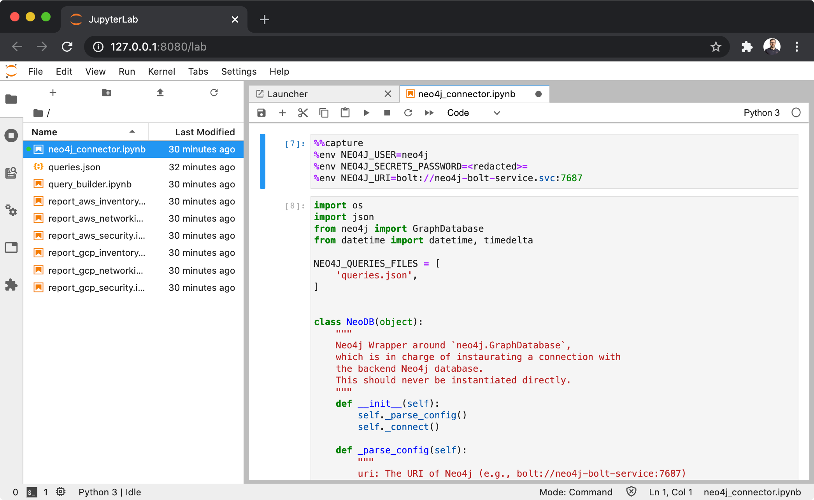

# Jupyter


## Jupyter Reports
With Jupyter, the most straightforward way to consume Cartography data is to use a series of
pre-defined reports made available by the scripts in the `notebooks` folder.

| Report Name             | Description                                                                         |
| ----------------------- | ----------------------------------------------------------------------------------- |
| `report_aws_inventory`  | Provides an inventory of the assets deployed in the AWS accounts                    |
| `report_aws_networking` | Contains networking relevant queries (SG, VPC, DNS, ELB, etc.) for the AWS accounts |
| `report_aws_security`   | Contains security relevant queries for the AWS accounts                             |
| `report_gcp_inventory`  | Provides an inventory of the assets deployed in the GCP projects                    |
| `report_gcp_networking` | Contains networking relevant queries for the GCP projects                           |
| `report_gcp_security`   | Contains security relevant queries for the GCP projects                             |

#### Run the reports
The easiest way to run and test this, is to use the following Docker image,
which runs a Jupyter lab preloaded with these reports:
```bash
❯ docker run --rm -p8080:8080 marcolancini/cartography_jupyter:latest
```




---


## Jupyter Notebooks
Anyone wanting to customise the reports provided in the section above (or to create new ones) can use Jupyter notebooks.

#### Extending the Code / Create new Notebooks
The core of the logic is contained in the `query_builder.ipynb` file, which introduces 2 abstraction objects:

* `QueryBuilder`: this is the main object, which gives high freedom in creating notebooks. The only exported method if `query`, which expects a list of filters and will run all the associated queries. Usage is explained in the code snippet below:
```python
# Instantiate the object
qb = QueryBuilder()

# The `query` method has 2 parameters:
#   1) TAGS
#       - list of tags like which usually includes the source (aws, gcp, k8s) and a kind of query (security)
#       - example: ['aws', 'security', 'inventory']
#   2) ACCOUNT
#       - optional account/project name
#       - example: account='test-account'
qb.query(['aws', 'security'])
qb.query(['gcp', 'security'], account='test-account')
```
* `ReportBuilder`: abstraction over the `QueryBuilder` object, created with the aim of having pre-defined and easy to use reports. The reports discussed in the first section of this document ("*Jupyter Reports*") are defined here. Usage is explained in the code snippet below:
```python
# Instantiate the object
r = ReportBuilder()
# Run one of the pre-made reports
r.report_aws_inventory()
```

Note that this scripts depends on `neo4j_connector.ipynb`: a wrapper around `neo4j.GraphDatabase`, which is in charge of instaurating a connection with the backend Neo4j database. This should never be instantiated directly from within notebooks.


#### Run a notebook
To run a notebook:
* Setup the environment variables needed to connect to Neo4j in the `neo4j_connector.ipynb` file (then delete those cells)
```
%%capture
%env NEO4J_URI=bolt://neo4j-bolt-service.svc:7687
%env NEO4J_USER=neo4j
%env NEO4J_SECRETS_PASSWORD=<redacted>
```
* Open the notebook
* Select: `Cell > Run All`
